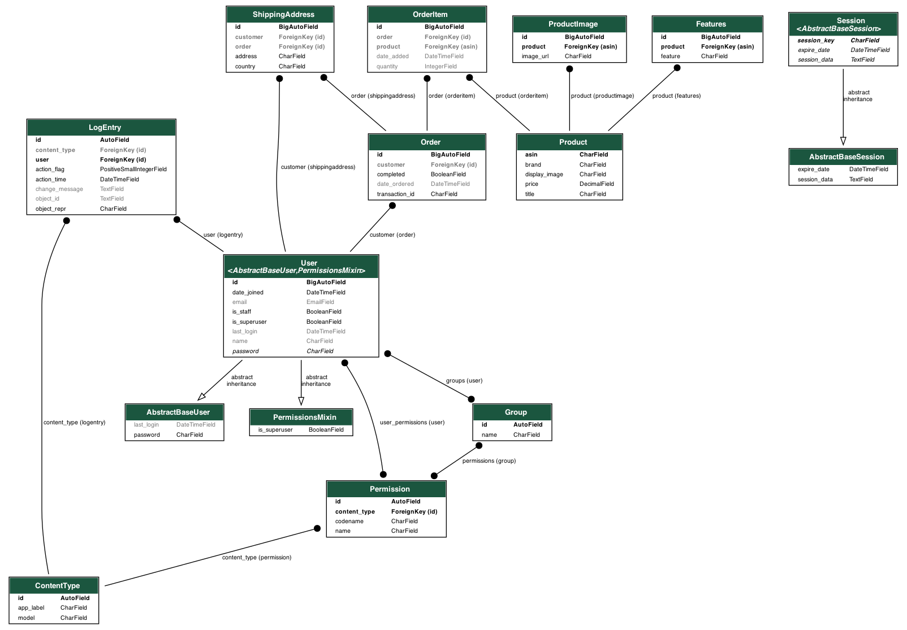

# Ecommerce Website

## How to run the app

### In Codio

1. Navigate to the folder
2. Run `python manage.py runserver` or `python3 manage.py runserver`

### To reproduce in a machine

1. Clone or download the zip folder
2. Navigate to the folder
3. Create a virtual environment `python3 -m venv <name of your env>`
4. Activate the virtual environment with `source venv/bin/activate`
5. Run `python3 manage.py makemigrations`
6. Run `python3 manage.py migrate`
7. Run `python3 manage.py runserver`

## About the app and the database

There are two apps: one for authentication and another for products. The authentication app contains a custom user model. Users have two different permissions: `is_staff` and `is_superuser`. Superusers have the power to do everything, while staff can view the dashboard page and admin data. Normal customers can only buy products.

The ER diagram below shows the models in the Django application. The product application includes a list feature and details. Products can be added to cart and checked out. Customers can see their details, and if a customer has `is_staff` status, they can access the dashboard page. The dashboard page displays sales numbers and a pie chart to show customer demographics.

## URLs

### Products

- `/` - lists products
- `/list/<str:id>` - shows product details based on ID
- `/dashboard` - shows sales data and pie chart (requires `is_staff`)
- `/cart` - shows cart items (login required)
- `/checkout` - checkout page (login required)
- `/detail` - shows account details (login required)

### Authentication

- `/users/login_page` - login page
- `/users/register_page` - register page
- `/users/logout` - logs a user out
